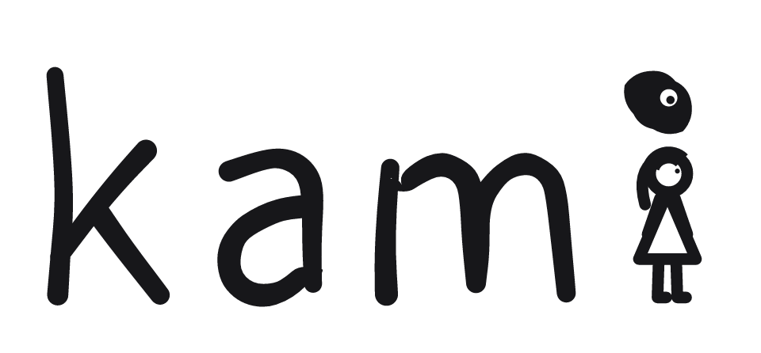
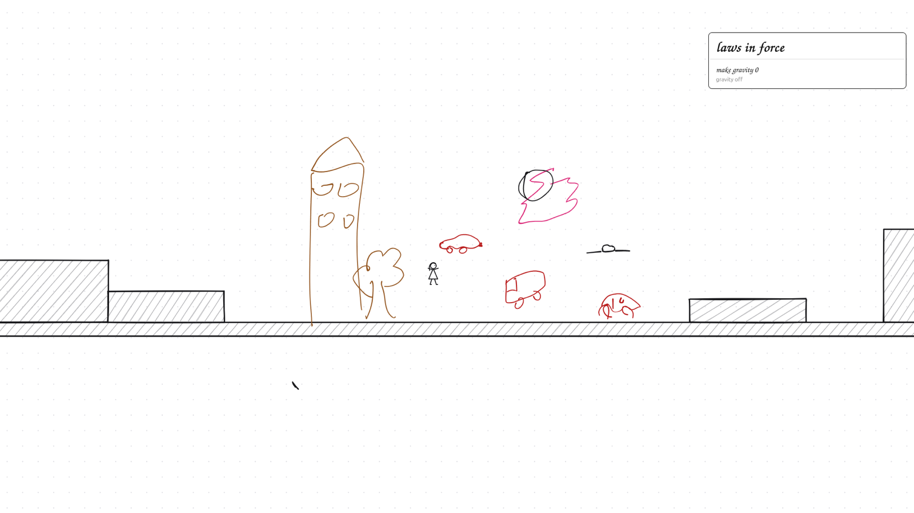
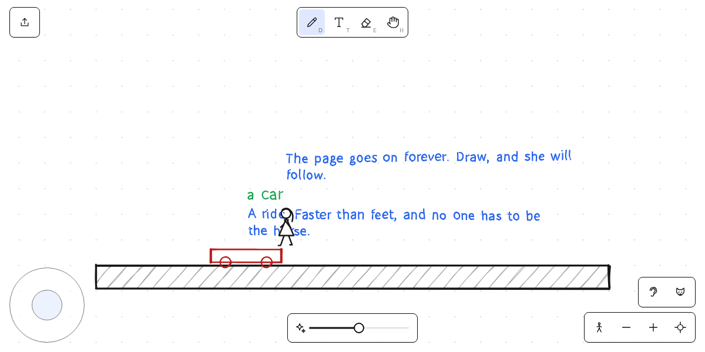
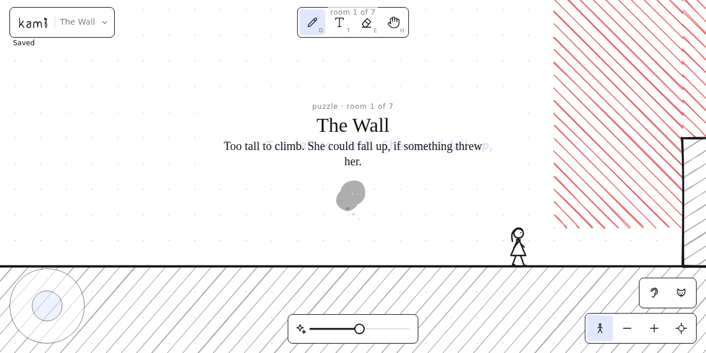
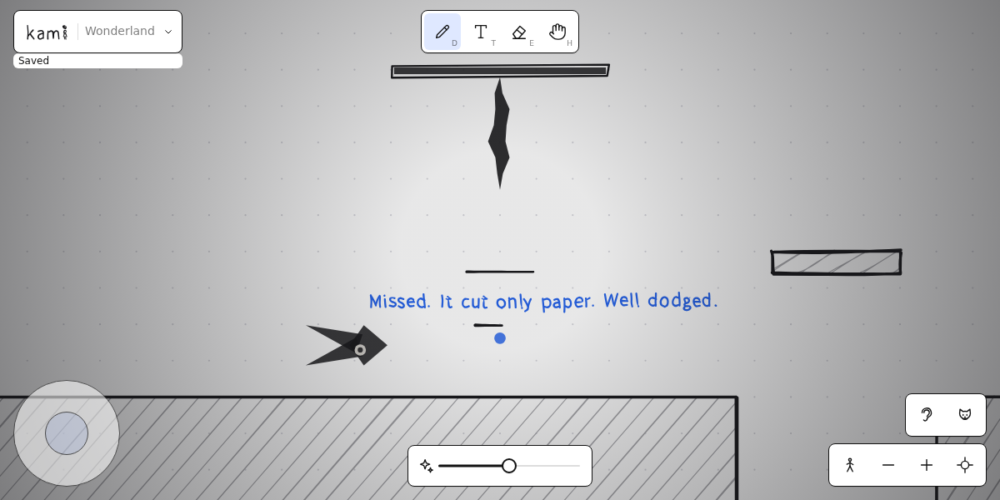
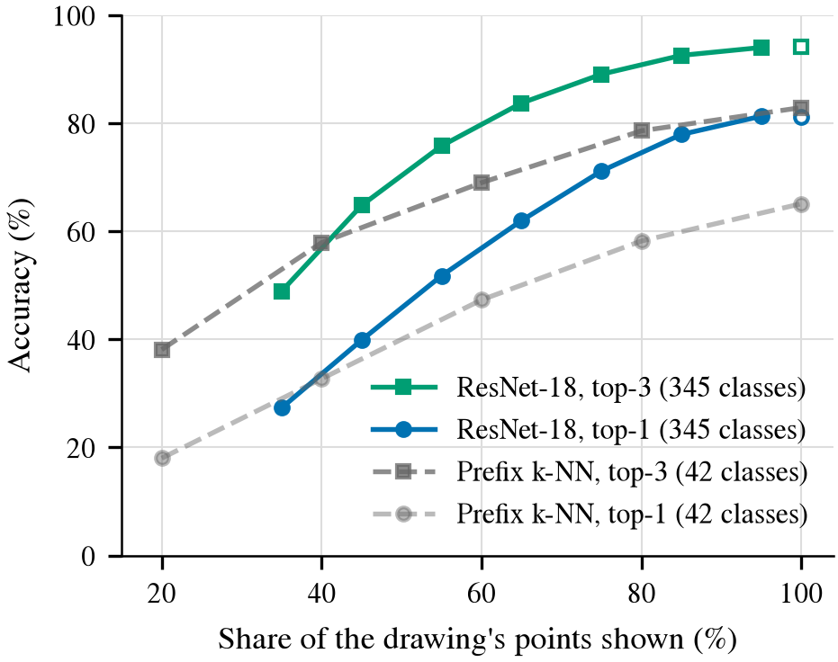
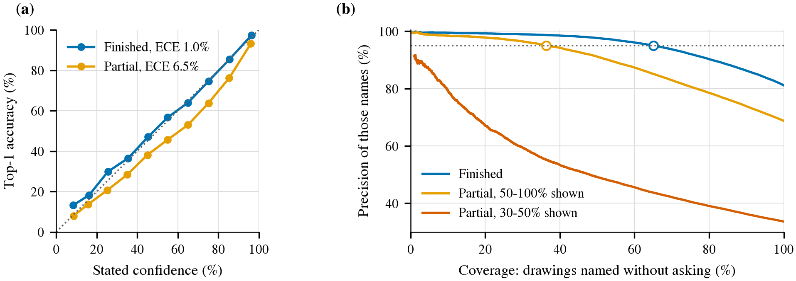

<p align="center">
  
</p>

<p align="center">
  <b>Draw it. Name it. It wakes up.</b><br>
  HackMIT 2026 · Alice in Wonderland · Entertainment track
</p>

*Kami* (紙) is paper; *kami* (神) is the spirit in a thing. It is a puzzle-platformer on one endless
whiteboard. Alice can hop, not fly — but you can draw. Whatever you sketch becomes solid ink, and
whatever you call it, it becomes: *a bouncy mushroom*, *a ladder*, *a car*. Write a law of physics on the
page and the world obeys it. Kami, the cat who lives in the paper, watches you draw, guesses what it is
before you finish, tidies your lines, writes back, and helps when you are stuck.

<p align="center">
  
</p>
<p align="center"><sub>The sandbox, mirrored to a big screen. Someone wrote <i>make gravity 0</i>, so everything they drew is floating.</sub></p>

## What you can do

- **Sketch** anything. The ink is solid: Alice walks on it, it falls, it piles up.
- **Name it** by writing beside it, and it becomes that thing — something that bounces, climbs, rolls,
  flies, lights the dark, or gets eaten. If Kami is sure what you drew, he names it for you.
- **Write a law** — *set g to the moon's*, *no friction*, *wind blows right*, *slow motion* — and physics
  changes for everything on the page. Erase the note and the law is repealed.
- **Ask Kami.** Write *help*. He answers in his own handwriting.
- **Slide the tidy slider** from *exactly what I drew* to *the cleanest version of it*.

<p align="center">
  
  
</p>
<p align="center">
  
  
</p>
<p align="center"><sub>Draw a car and name it · a puzzle room · the boss fight · how early Kami recognises a drawing</sub></p>

## Ways to play

The start screen offers the first three; the address picks any of them directly.

| Mode | Address | What it is |
|---|---|---|
| Sandbox | `?mode=sandbox` | An endless page that everyone who opens it draws on together |
| Puzzle | `?mode=puzzle` | Staged rooms, each solved by one drawn or written idea, with an ink eater loose |
| Boss | `?mode=boss` | Two players, one draws and one moves; you start as a heart with no body, and something is coming to snip it |
| Wonderland | `?mode=embodied` | The original adventure in seven stretches, from the Riverbank through the Hall of Doors and the Pool of Tears to the Mad Tea Party |
| Spirit | `?mode=spirit` | There is no Alice: draw one, name her, and she is yours |

Add `&board=<name>` to open or create a particular board. Open `/?screen` on a monitor and it shows,
live, whichever device is being drawn on ([docs/screen.md](docs/screen.md)).

## Run it

```bash
bun install
bun run quickdraw:ingest   # once: a small set of Quick, Draw! sketches for offline recognition
bun run dev                # the game on :5173, the API and MongoDB on :8787
```

Open the printed **Network** address on an iPad on the same Wi-Fi, or play on the laptop: the mouse draws,
arrow keys walk, `D` `T` `E` `H` pick draw, write, erase and pan, and holding Space pans. With nothing configured the game still
plays: drawings are recognised by a nearest-neighbour fallback and laws by an offline grammar. The rest is
optional and set by environment variables ([server/README.md](server/README.md)): a recognition sidecar
(`KAMI_RECOGNIZER_URL`), any OpenAI-compatible model for the laws the grammar cannot read (`KAMI_LLM_URL`),
and `MONGODB_URI`.

`bun run check` is the gate: typecheck, lint and about 2,400 tests, including headless playthroughs of
whole boards.

## Host it

One container carries the server, the built game, an embedded MongoDB and the sketches it recognises
with, so a fresh host plays at once:

```bash
podman run -d --name kami -p 8080:8080 -v kami-data:/data --read-only --tmpfs /tmp \
  --cap-drop=ALL --security-opt no-new-privileges ghcr.io/snowballsh/kami:latest
```

[docs/hosting.md](docs/hosting.md) has the compose file, every setting (models, storage, access,
performance), the optional Eye sidecar image, a reverse-proxy example and what `shared` mode means
before anything faces the internet.

## How it works

- **Ink is physics.** Strokes become rigid bodies in a fixed-step simulation (matter-js); a name gives
  a drawing one of a handful of *natures*; a law is a small typed effect folded over the world's physics.
- **Kami's Eye.** One ResNet-18 trained on all 345 Quick, Draw! categories, with half of its training
  drawings cut short so it can guess while you are still drawing: **83 % top-1 and 95 % top-3** on finished
  sketches, and already 82 % top-3 at sixty per cent of the ink. It is calibrated, so Kami names a drawing
  himself only when he would be right 95 % of the time, and asks otherwise. Tidying morphs your own
  strokes toward the dataset drawing most like them, facing the way yours faces.
  [Results](docs/reports/kami-eye-results.md) · [the k-NN it replaced](docs/reports/prefix-knn.md) ·
  [the contract](ml/CONTRACT.md)
- **Laws.** An offline grammar reads the common ones instantly; a local language model compiles the
  rest into the same typed effect, once per law, never in the frame loop.
- **Everything runs on one box.** Training, inference, the language model, the database and the game
  server all ran on an ASUS Ascent GX10 at the venue ([scripts/gx10](scripts/gx10)); the iPads only draw.
- **A joystick and a big screen.** An Arduino arcade stick over UDP or serial ([controllers](docs/controllers.md)), and a monitor that mirrors the device in
  play by replaying its render data rather than streaming video ([screen](docs/screen.md)).

<p align="center">
  
</p>
<p align="center"><sub>Left: stated confidence against accuracy. Right: at 95 % precision Kami names 71 % of finished drawings without asking.</sub></p>

## Read more

| | |
|---|---|
| [docs/spec.md](docs/spec.md) | What Kami is: pillars, mechanics, the cat, the rooms |
| [docs/architecture.md](docs/architecture.md) | How the code fits together, the contracts between its parts, and what has and has not been verified |
| [docs/modes.md](docs/modes.md) · [puzzles](docs/puzzles.md) · [boss](docs/boss.md) · [laws](docs/laws.md) | The ways to play and the rules of each |
| [server/README.md](server/README.md) | The API, configuration and the GX10 deployment |
| [docs/hosting.md](docs/hosting.md) | Hosting Kami anywhere with podman or docker: images, compose, settings, reverse proxy |
| [ml/README.md](ml/README.md) | Training and serving Kami's Eye |
| [docs/hardware.md](docs/hardware.md) | The arcade cabinet: what is built and what is not |
| [docs/archive](docs/archive) | Earlier plans, kept as history |

Built in a weekend by a small team with two coding agents working side by side, Claude Code and Devin;
[AGENTS.md](AGENTS.md) is the agreement they worked under.

## Licence and credits

Kami's code, documentation and artwork are under the [MIT License](LICENSE). Kami learnt to see from
[The Quick, Draw! Dataset](https://github.com/googlecreativelab/quickdraw-dataset), made available by
Google, Inc. under [CC BY 4.0](https://creativecommons.org/licenses/by/4.0/); the dataset is not in this
repository, and the drawings Kami summons, and those in Figure 5 of the results, are its contributors'
work. His handwriting is a subset of EMS Readability (SIL OFL 1.1). Details in [NOTICE.md](NOTICE.md).
