# Gameplay gallery — UX sweep

Screenshots taken in the browser against the local dev stack (`bun run dev`, 1600×1200 window), one entry per scenario.
`-before` shots show the problem as found; `-after` shots show the fix. Every entry lists what it demonstrates,
what was wrong, what was fixed and what still needs polish. Branch: `devin/ux-sweep`.

## Puzzle

### puzzle-01-wall-open-before.png — Puzzle room 1 ("The Wall"), first frame
- **Shows:** room entry with `?mode=puzzle`.
- **Wrong:** the title card sits on top of four handwritten Kami lines (wordmark, tagline, the Sumikui's waking line, and the
  room intro written a second time by hand); the Sumikui is already loose beside Alice before the player has drawn anything.
- **Status:** fixing — the ink eater should wake only after the player's first drawing, and the room card should be the only
  text on screen at entry.

### puzzle-01-wall-8s-before.png — same room, 8 s later, no input
- **Shows:** Alice fleeing the Sumikui under autopilot.
- **Wrong:** Kami writes "Look at her go. Fear is a fine teacher." / "It is on her heels…" ~12 times in 8 s; the flee
  news fires every time the pilot replans. Notes stack on top of each other and cover Alice.
- **Status:** fixing — one remark per dread episode, and Kami keeps at most two remarks on screen (the older one leaves).

### puzzle-01-wall-open-after.png — room 1, first frame, after the fix
- **Shows:** the room card alone; the Sumikui stirs quietly behind Alice (grey, biding) instead of hunting.
- **Fixed:** a room's ink-eater law folded at entry bides until the first drawing (`Simulation.underway`); the
  wordmark/tagline are no longer handwritten in Puzzle/Boss; flee/stuck lines have a calm window; ≤ 2 Kami remarks.
- **Still wrong:** the handwritten room intro is written exactly where the DOM room card sits, so the two overlap for the
  card's lifetime. → fix: hold Kami's opening lines until the room card has left (or write them below it).

### puzzle-01-wall-first-ink-after.png / puzzle-01-wall-line-eaten-after.png — first drawing wakes it
- **Shows:** a flat line at Alice's feet; the Sumikui wakes ("It smells ink…"), goes for the line, and chews it
  (particles, "Gone. It drank that line to the last drop."). Alice is left alone for the first 20 s awake.
- **Wrong:** guess chips ("a trampoline? a mushroom? a ball?") are laid out downward over the ground hatch and under the
  tidiness slider — they should stay above the ground line, on the paper.

### puzzle-01-wall-note-clipped.png — 24 s
- **Wrong:** Kami's lines are written at the spawn column regardless of the camera, and run off the right edge
  ("Draw her somewher…"). Notes need to be laid out inside the visible viewport (shift left, or wrap earlier).
- **Wrong:** Kami says "She sees it. She runs." but Alice stood still for the next 10 s with the eater on her.
  → check the pilot's flee route on a flat one-way room (nothing to flee *to* → cornered, so she should at least
  keep walking away).

### puzzle-01-wall-30s-caught.png — 34 s
- **Shows:** grace over (20 s awake) — it bites the ground under her / swallows her. Intended stakes; fair now that the
  player had 20 s and a wake line first.

## Boss

Scripted the drawer's side over CDP: open `?mode=boss`, draw a stick figure around the heart, write `alice`,
then hold the keys for the player's side while the servant comes.

### boss-open-before.png / boss-named-before.png / boss-fight-before.png — as found
- **Expected**: a quiet opening (card, heart, one hint), then a body the game accepts, then a readable fight.
- **Observed**: both role paragraphs handwritten across the upper playfield under the mode card; the health bar
  sitting on the toolbar; "Only a heart, so far…" clipped at the right edge; after naming, three more lines
  stacked on top of the role text; the drawn body was offered as "a mushroom? a cake? a cloud?" unless the
  name was written touching it; an incarnated Alice with natural legs could not walk (legs read as torso/arms);
  by 10 s legs, arms and head were gone; one cut removed every stroke it crossed; the Wonderland zone intro
  ("She can hop, not fly") appeared in Boss; drawings from the previous fight came back on restart.
- **Fixed**: roles are bullets on the card, not notes; health bar below the toolbar; free notes clamp to the
  viewport and keep clear of the tear and the top strip; the opening recital waits for the card to fade; a
  nameless drawing near the soul is offered as `Alice?` ("Is this her? Write who she is.") and `alice` written
  anywhere names the drawing nearest the soul; parts are read relative to the torso (arms beside, legs below,
  head/wings above), so a stick figure walks, climbs and sees; a snip only takes the part it aimed at; first
  circle 4.8 s, circle 3.4 s, 3.2 s mercy after a hit; Boss skips the zone intro and starts on a fresh page.

### boss-01-open-after.png → boss-10-fight-35s-after.png — the fight after the fixes, one frame per beat
- `01-open`: card + hovering heart, nothing else on the page. `03-body-drawn`/`04-named`: the figure, the
  `Alice?` chip, incarnation, the missing-part line if any. `05-tear`/`06-servant`: the tear opens above her,
  the recital arrives one line at a time. `07-fight-10s`: first snip ("It took her legs… draw them back,
  quickly."), servant recovering. `08a-walking`: player steering with keys on the remaining body.
  `08c-redrawn`: drawer's strokes graft onto the body (glow) instead of becoming "a plank?". `09-fight-25s`:
  torso cut, dusk veil from the tear. `10-fight-35s`: heart cut → "Missed…"/restart, page clean.
- **Still to polish** (C-items below): `09` says "Her wings, gone" for a body that never had wings — arm
  strokes were read as wings (fixed in `f65db4c`, not yet re-shot); the redraw strokes render in the
  highlight blue, which reads as "selected" rather than "ink becoming her"; no run has reached a win yet
  (the weapon needs a drawn stroke to be swung through the servant — untested here); the two-player split
  (one device draws, one steers) is not exercised by the script.

## Vehicles

Scripted in Sandbox on a fresh board: draw a box car with two wheels beside Alice, write `a car`, hold ← until she
boards and drives off the ledge.

### vehicle-01.png → vehicle-08-after.png
- **Expected**: Alice hops in and sits; the car drives; off the ledge it tumbles like a thrown box; she comes back.
- **Observed before**: the car never tilted (upright creature strategy) and Alice stood beside/over it; a parked
  car sat crooked while she climbed on; off the ledge she fell through blank page for ~4 s with no word from
  Kami and the car was gone for good.
- **Fixed**: vehicles have their own nature (`upright: false`): they roll, tip and flip (`05`, `07`); a gentle
  keel only rights small grounded tilts and yields to "the car spins"; Alice hops aboard (`01`) and sinks into
  the seat, the car is painted over her lower body (`03`); the fall limit is 900 px and the car she was in
  returns with her, level (`08-after`); Kami says "Off the edge of the page…".
- **Still to polish**: a closed box car has no cabin, so a seated Alice reads as "standing on the roof" — an
  open-top car (or hiding her legs inside the outline) would sell the pose; the respawn is the very last
  footing, right at the ledge, so the car lands half over the edge; the "Off the edge" line was not on screen in
  `08-after` (may have faded with the note cap — check timing).

## Sweep 1 — start, laws, summons, Sumikui, creatures, text, HUD (contact sheets)

Scripted in Sandbox on fresh boards; each `sweep1-*-sheet.png` is a grid of the full-screen frames named in its captions.
Caveat: during this sweep the local API server was a stale process (started before the day's merges, no `--watch`), so
`/api/exemplar` answered "no picture of rabbit" and board saves timed out — everything below that needed the server is
re-run in sweep 2 with the server restarted. The offline grammar, sim, render and HUD findings stand.

### sweep1-start-sheet.png — start screen and the three openings
- **Shows:** start screen with exactly Sandbox / Puzzle / Boss; each mode's first frame and its card.
- **OK:** one tap starts; the card is the only text at entry in all three; Boss opens on the heart alone.

### sweep1-laws-sheet.png — gravity, fly, size, speed, night, upside down, sideways, panel, repeal
- **Shows:** each law answered under the sentence, the panel listing them, night rendering, the page turned.
- **OK:** every offline law took on the first try; night keeps handwriting readable; the laws panel stays put while
  the page rotates (HUD is not rotated with the paper — correct).
- **Wrong:** Alice is off-screen in most frames — she walked off the end of the start plank and fell (see the ledge
  sheet below), so the laws frames show the page without her. Re-shot in sweep 2 with her kept on the plank.

### sweep1-sandbox-ledge-sheet.png — walking off the Sandbox plank
- **Shows:** hold → for 2.5 s from spawn: frame 1 is blank page (she has fallen 900 px and the camera is with her);
  frame 2 she is back on the plank's end; frames 3–4 flying after "alice can fly" (camera keeps her low in frame, fine).
- **Polish:** the respawn point is her *last footing*, which is the very lip of the plank — a held stick walks her straight
  off again. Respawn a step back from the edge (record footing only when her whole stance is supported, or step 40 px
  toward the plank's centre). Also: nothing says where she went for the ~1.5 s of blank page except the new "Off the edge of
  the page…" line, which was not visible in frame 1 — check the remark fires before the camera leaves.

### sweep1-summon-sheet.png — "summon a rabbit", unknown noun, moon, home
- **Wrong (env):** "I've never seen a rabbit. Draw one for me, and I'll learn its name." — the stale server; the fallback
  line itself reads well. Re-run in sweep 2.
- **OK:** "teleport us to the moon" → 0.17 g, drag off, dusk, and the panel lists the scene as one law.
- **Wrong:** "take us home" writes Kami's long answer ("home: gravity = 1 g (Earth), wind off, time runs at 1x, …") straight
  across Alice and the plank — Kami's free notes avoid other writing but not Alice or the ground. → free-note layout should
  treat Alice's bounds and board solids as obstacles (the Boss tear/health strip already are).
- **Polish:** after "take us home" the panel shows *both* "teleport us to the moon" and "take us home" as standing laws;
  home should retire the scene it undoes.

### sweep1-sumikui-sheet.png — Sumikui in Sandbox
- **OK:** "summon the sumikui" → "Nothing hungry lives on this page." (Sandbox has no ink eater by design). Alice does not
  flinch, nothing is eaten, the cup doodle survives 24 s.
- **Wrong:** the guess chips for the cup ("And what is that suppo… / a plank? / a platform? / a trampoline?") are laid out to
  the right of the drawing and run off the screen edge — the question is cut mid-word. Guess chips need the same viewport
  clamp Kami's free notes got.
- **Wrong:** "banish the sumikui" gets no answer at all when there is none — Kami should say so ("There is nothing here to
  banish.").
- **Polish:** "a plank? a platform? a trampoline?" for a cup shape — the k-NN Eye is guessing from the flat bottom; fine
  offline, the GX10 Eye is the real recogniser (untested tonight).

### sweep1-creatures-sheet.png — "a dog", "the dog can fly", "a shy mouse", "the mouse chases me"
- **OK:** the dog and mouse take their names, "the dog can fly" and "the mouse chases me" → "follows Alice" land as targeted
  laws in the panel, the mouse runs to her.
- **Wrong:** ~4 s *after* "a dog" was written under the circle, Kami still asks "And what is that supposed to be? a mushroom?
  a cake? a balloon?" — the guess chips arrive after the name (the name went through the slow server, so `look()` finished
  first). `offerGuesses` checks the ledger ruling only once; if it finds none because naming is still in flight, the chips
  should be dropped when the name lands (they are anchored to the drawing and `name()` removes anchored notes — so check
  why they survived; likely written after `name()` ran). Re-checked in sweep 2 with the fast server.
- **Wrong:** the chips for the second circle are laid out over the circle itself and over the older chips.

### sweep1-text-sheet.png — nonsense sentences
- **OK:** "purple monday", "marbles remember rain", "seven chairs are singing" → one "Hm. I can't make that true. Yet.
  Write it beside a drawing, or tell me a law of physics."; "the moon forgot my name" → "Curious. But what should it do?
  Write it…"; everything (player's words included) is gone by 20 s. Model fallback for these is GX10-only (untested).
- **Wrong:** "Curious. But what should it do?" is written across Alice's feet and the plank (same obstacle gap as above).
- **Polish:** replies land far from the sentence they answer when the space under it is taken; prefer right of the sentence
  before jumping down the page.

### sweep1-hud-sheet.png — every button
- **OK:** draw / text / erase / hand switch and highlight; ear → "I have no microphone to listen with. Allow it, and try
  again." (visible failure, was silent before); walk button moves her; − / + zoom; ⌖ recentres; share opens the QR card with
  board id and "copy link"; tidiness slider drags.
- **Wrong:** the ear line is written interleaved with the intro ("The page goes on forever. Draw, and she will / follow.") —
  the second line of the intro and the first line of the mic note share a baseline. Note layout must reserve the full wrapped
  height of a note, not its first line.
- **Polish:** the share card covers the thumbstick's top-left; place it right of the share button or above the stick.

## Sweep plan — every mode × every feature × the edge cases

Checked as I go; each item gets a screenshot (or a note why not). Edge cases looked for on every item:
text spam / duplicate lines, notes stacking or covering Alice/HUD/walls, intro + threat text at the same time, lines
that never fade, cascades from one event, threats before the first player action, stuck/flee/cornered repeating on
every replan, dead buttons, controls that work in one mode only, camera not following, wrong poses, snapping
transitions, physics changed by presentation, stale state after respawn/room change, room card over live play.

### A. Start & modes
- [ ] A1 Start screen (three choices, `?mode=` bypass, other params kept)
- [ ] A2 Sandbox entry: card, wordmark/tagline, no ink eater, `summon the ink eater` refused politely
- [ ] A3 Puzzle entry: card only, no Sumikui before the first drawing, no repeated flee lines
- [ ] A4 Boss entry: heart alone, roles readable, no Alice/autopilot text, nothing arrives before naming

### B. Puzzle rooms (each: entry, solve, closing line, transition, room card timing, Sumikui pressure)
- [ ] B1 The Wall (spring) · B2 Keyhole (bottle/`alice is tiny`) · B3 Moon Ledge (`low gravity`) · B4 Dark Hall (lantern)
- [ ] B5 Twin Doors (portals) · B6 Shaft (`alice can fly`) · B7 Pit (spring + low gravity) · B8 after room 7
- [ ] B9 Forbidden law in a room (`Not in this game…` once, not per frame) · B10 Alice eaten in a room → respawn clean

### C. Boss (two-player)
- [x] C1 Heart, draw body, name `alice` → incarnation, ability readout · [x] C2 Tear + servant arrival timing/text
- [x] C3 Wind-up telegraph readable, dodge works with keys · [x] C4 Snip → part gone, ability lost, line once
- [~] C5 Redraw/graft (grafts; glow colour to revisit) · [~] C6 Shield with a drawing (one stroke blocked a cut) · [ ] C7 Weapon hit, health bar, waves
- [ ] C8 Win: tear closes · [x] C9 Loss: heart cut → restart clean (fresh page, no zone intro) · [ ] C10 Camera framing, thumbstick dodge

### D. Drawing & ink
- [ ] D1 Solid stroke platform · D2 Scenery (non load-bearing) strokes walk-through · D3 Erase · D4 Placement refusals
- [ ] D5 Naming beside a drawing vs bare noun summon · D6 Guess chips tap-to-name · D7 Clear board (double tap)

### E. Alice
- [ ] E1 Autopilot to goal · E2 Manual keys/thumbstick override + return · E3 Jump · E4 Stuck line once
- [ ] E5 Size laws (headroom) · E6 Fly · E7 Speed · E8 Clones (independent) · E9 Twin select · E10 Night + lantern

### F. Vehicles & creatures
- [ ] F1 Board a car: hop-in + seated pose (user report: Alice not in car) · F2 Drive · F3 Car tips/flips rendered (user report: no flip)
- [ ] F4 Dismount by jump · F5 Boat · F6 Walker/hopper/flier alive · F7 Ride a creature (astride) · F8 Follow/flee
- [ ] F9 `the cat chases me` law · F10 Creature powers (`the dog can fly`) · F11 Portals pair + lonely portal

### G. Laws & world
- [ ] G1 Gravity (`low gravity`, `gravity points left`) · G2 Time · G3 Friction/bounce/wind/drag · G4 Repeal by erase & by panel
- [ ] G5 Laws panel after note fades · G6 Spin/thrust/mass on a drawing · G7 `everything spins` · G8 Tilt world 90° (pointer mapping, HUD)
- [ ] G9 World spins slowly · G10 Reset words (`normal gravity`) · G11 Unknown law shrug (once) · G12 Model-only path (untested tonight)

### H. Summons & scenes
- [ ] H1 `summon a rabbit` · H2 Summon unknown word · H3 `teleport us to the moon` (props, gravity, gloss) · H4 `back home`
- [ ] H5 Scene + Sumikui/autopilot interplay · H6 Unknown scene line

### I. Sumikui
- [ ] I1 Summon lore pacing (3 lines, not on top of each other) · I2 Chase speed fair · I3 Eats a drawing stroke-by-stroke, size-scaled
- [ ] I4 Particles · I5 Bites paper under Alice, heals · I6 Eats Alice → respawn, one line · I7 Ignores/sweeps scribbles
- [ ] I8 Spares scenery/named? · I9 Banish · I10 Autopilot flees/races, cornered once

### J. HUD & text
- [ ] J1 Wordmark/tagline placement · J2 Guess/hint/remark lifetimes · J3 Overlap avoidance under load · J4 Room/title card vs live play
- [ ] J5 Zoom/back-to-Alice/autopilot toggle · J6 Tidy slider · J7 Talk button feedback (deaf line locally) · J8 Persistence status
- [ ] J9 Share panel (sandbox) · J10 Small window / touch layout

## Sweep 2 — summons (fresh API), creatures, Puzzle rooms, Boss, rotation, boats (contact sheets)

### summon2 — fresh-API summons
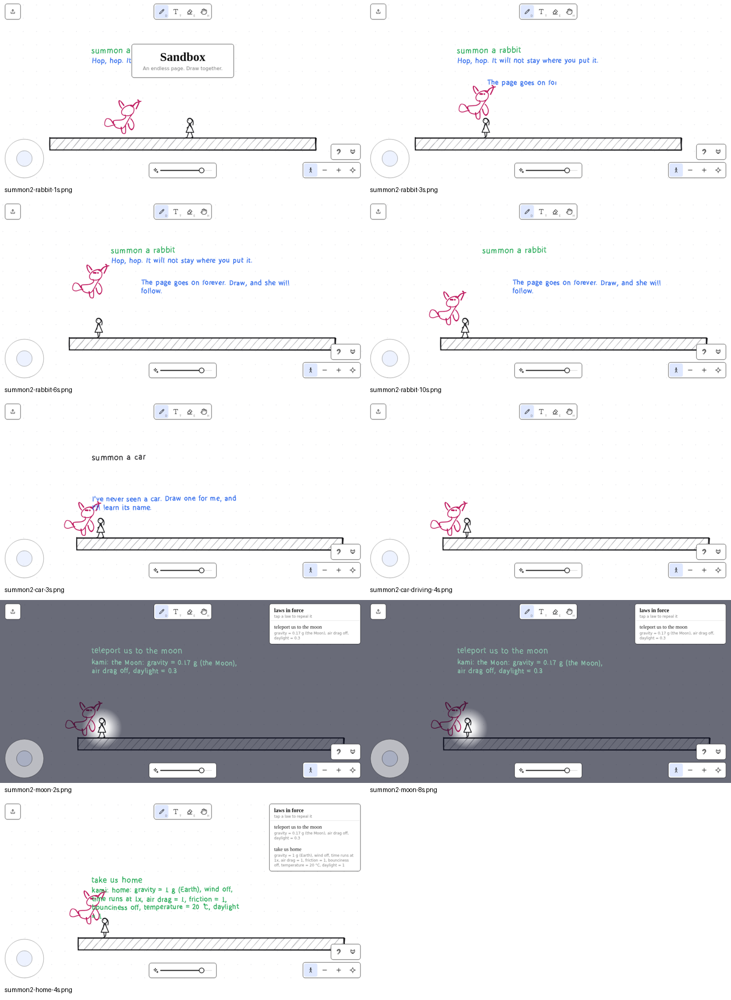
- **Scenario:** On a fresh Sandbox board, summon a rabbit, request a car, visit the Moon, and return home.
- **Expected:** Rabbit and car are drawn and named; Moon/home transitions work.
- **Observed:** Rabbit works with the restarted API and is inked stroke by stroke. “summon a car” produces
  “I've never seen a car. Draw one for me, and I can learn its name.” Moon/home scene transitions work;
  “take us home” leaves both laws listed, as in sweep 1. Persistence timeout warnings still appear.
- **Finding:** There is no local exemplar category for car; the GX10 model path is not testable locally.
- **Status:** Open for car recognition and persistence timeout.
- **Recommendation:** Add or expose a car exemplar/category, and investigate the persistence timeout.

### creatures2 — named creatures and riding
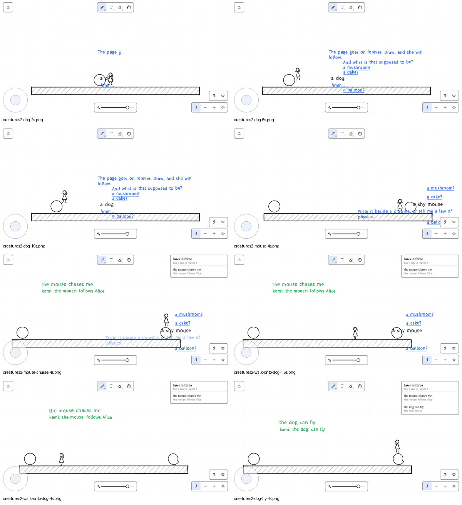
- **Scenario:** Draw and name a dog, draw and name a distant shy mouse, issue chase and flight laws, then walk Alice over the dog.
- **Expected:** A bare name attaches to the intended drawing; creatures follow their laws and Alice can ride the dog.
- **Observed:** In this run, “a dog” was written about one second after the circle and fell through to “hmm…” and model guesses;
  the guess chips stayed with the black label. A direct re-probe after a 1.5-second pause names the dog correctly and Alice rides it
  (`sweep2-note-avoids-ground-before.png` / `sweep2-note-avoids-ground-after.png`). Mouse guesses crowd the right edge and
  notes crossed the ground in the captured run; the latter is fixed by the note-obstacle change. “the mouse chases me” becomes
  “the mouse: follows Alice”, and “the dog can fly” works.
- **Finding:** A bare-name note can arrive before the drawing has landed and miss it; the right-edge and ground placement issues
  are addressed in this sweep. Model-dependent recognition is not testable locally.
- **Status:** Naming race open; free-note placement fixed.
- **Recommendation:** Hold a bare-name note until pending drawing ink lands, or widen `drawingNear` to include in-flight ink.

### puzzle-rooms — seven Puzzle rooms
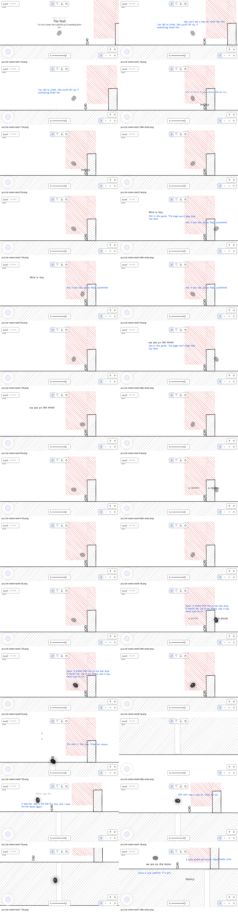
- **Scenario:** Enter fresh Puzzle mode, idle in each room, then attempt the documented drawing/law solution in order.
- **Expected:** Each solution advances to the next room and shows its room card.
- **Observed:** Room 1’s “The Wall” title card is correct, and quiet entry has no Sumikui/ground bite before first ink.
  The scripted bouncy blob did not get Alice over the wall; the corrected attempt remained blocked, so rooms 2–7 were not reached.
  “alice is tiny” was correctly refused in room 1. The definitions used were `src/board/boards/puzzles/index.ts` and
  `src/board/boards/puzzles/{theWall,theKeyhole,theMoonLedge,theDarkHall,theTwinDoors,theShaft,thePit}.ts`.
- **Finding:** The scripted solve did not solve room 1; this is a script limitation, not a confirmed game bug.
- **Status:** Coverage gap for rooms 2–7.
- **Recommendation:** Re-run with a room-1 drawing placed at the wall foot, then exercise each remaining room. Sumikui/model behavior
  beyond this local scripted path is not testable locally.

### boss2 — Boss combat flow
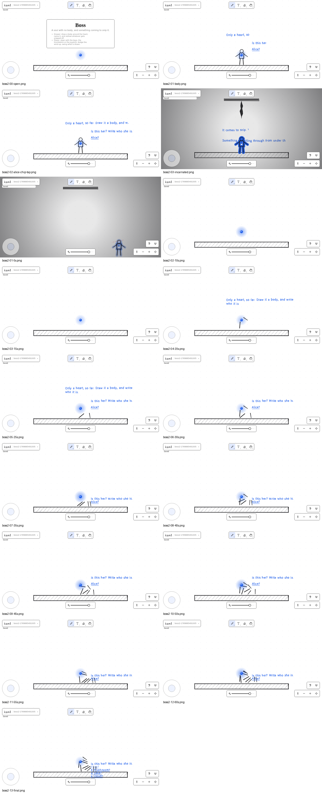
- **Scenario:** Draw a body around the soul, attempt the `Alice?` chip, incarnate with `alice`, steer, and redraw parts for 60 seconds.
- **Expected:** The chip incarnates Alice, servant waves and snips remove parts, grafts restore them, and a terminal result appears.
- **Observed:** The script tapped `(600,340)` while the `Alice?` chip was around `(678–736,348–383)`, so the chip was missed.
  The chip path is covered by the regression at `src/game/game.test.ts:2450-2470`; writing `alice` also incarnates successfully.
  The heart was swallowed within about 10 seconds while the body stood still, then the room restarted silently. The script never
  wrote `alice` again, so a second incarnation was never attempted. The root cause of the veil, incomplete body, and later missed
  snips was the 900 ms commit delay: the 1.8-second pauses made every stroke a separate drawing, and naming embodied only the
  nearest one. Incarnation now absorbs neighbouring nameless ink within graft reach.
- **Finding:** The chip report is withdrawn: not a bug, a scripted tap miss. The per-stroke drawing/partial-incarnation root cause is
  fixed by neighbouring-ink absorption. Still open: an idle fresh body can be killed in under 10 seconds; the servant's
  mercy/first-circle timing needs checking for a first-time pair. Boss win (`tear-closed`) currently presents only a Kami line,
  with no terminal card.
- **Status:** Chip finding closed; body clustering fixed; first-time loss pacing and win presentation remain open.
- **Recommendation:** Check `mercy`/first-circle timing in `docs/boss.md` for a first-time pair, then add a “Closed” card through
  the same `again`-style hook. GX10/model/Deepgram-dependent behavior is not testable locally.

### rotation — world rotation and pointer mapping
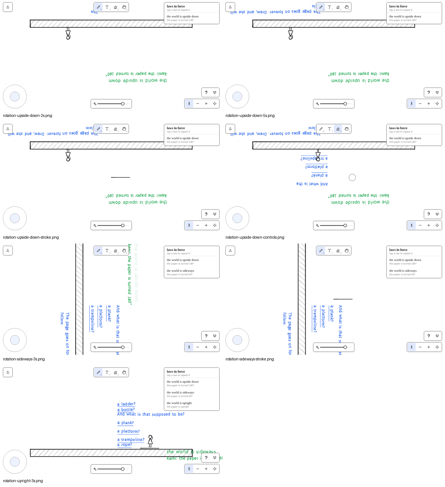
- **Scenario:** Rotate upside down and sideways, draw at screen `(600,300)`, exercise toolbar/zoom controls, and restore upright.
- **Expected:** World content rotates while HUD controls remain usable; pointer input lands at the requested screen location.
- **Observed:** Upside-down and sideways rendering work, the laws panel stays upright, and toolbar controls remain clickable.
  The stroke lands at approximately screen `x=599–700, y=299–300` in both rotated states, preserving screen position.
  Restoring upright leaves the rotation laws listed.
- **Finding:** Pointer-to-world mapping and controls are correct; law cleanup remains open.
- **Status:** Rotation behavior passes; cleanup open.
- **Recommendation:** Repeal superseded rotation laws when upright is restored.

### boat — boat naming and buoyancy
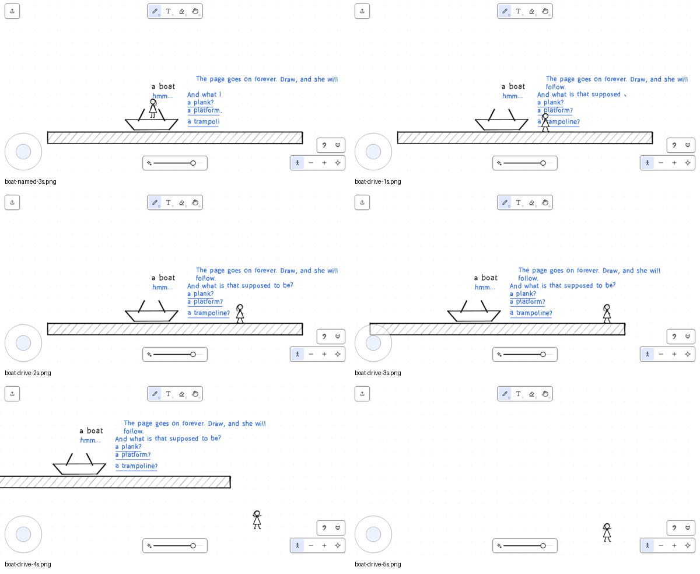
- **Scenario:** Draw a closed boat-like hull in Sandbox, name it “a boat”, and attempt to board and drive it.
- **Expected:** The boat resolves as a vehicle, Alice boards, and buoyancy/driving can be exercised.
- **Observed:** The hull draws, but “a boat” is not accepted as a vehicle name; guesses include “a plank?”, “a platform?”, and
  “a trampoline?”. Alice walks past it and it does not move.
- **Finding:** Inspect the lexicon so “boat” resolves to vehicle. Sandbox has no water, so buoyancy is not testable locally.
- **Status:** Open for boat lexicon; water behavior not testable locally.
- **Recommendation:** Add the boat mapping and re-run in a board with a water region.

## Sweep 3 — Sandbox

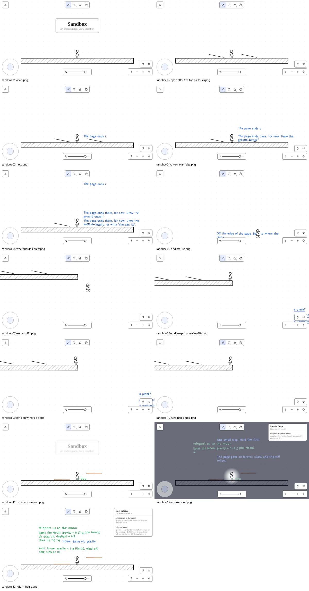

| Scenario | Expected | Observed | Status |
| --- | --- | --- | --- |
| Open | Sandbox title/opening line; no Sumikui after 20 s and two platforms | Title/opening appeared; two platforms remained and no Sumikui appeared after 20 s | Fixed/Pass |
| Help | `help`, `give me an idea`, and `what should I draw` give scene counsel without repeating a visible line | Scene counsel appeared; identical counsel no longer repeats while visible | Fixed |
| Endless page + fall-return | Camera follows the walk, page continues, Alice can return by drawing a far platform | Camera followed; Alice reached the page edge/off-ground; a far platform held her | Pass; edge behavior observed |
| Two tabs | Drawing and naming sync live; presence ghost is visible | Drawing synced; name was delayed in the captured tab-A frame; no presence ghost was seen | Drawing pass; name delay and ghost open |
| Persistence | Reload keeps drawings/names without a memory warning | Fresh-tab load retained drawings and `dog`; literal CDP reload was unmeasured because it hung; no warning appeared | Fresh-load pass; reload open |
| Moon/home | Returning home replaces the Moon laws | Moon then home left only the `take us home` scene law | Fixed |

The right-edge guess-chip overflow visible around `sandbox-08`/`sandbox-09` remains open.

## Sweep 4 — opening cards, anchored notes, Sumikui, and Puzzle rooms

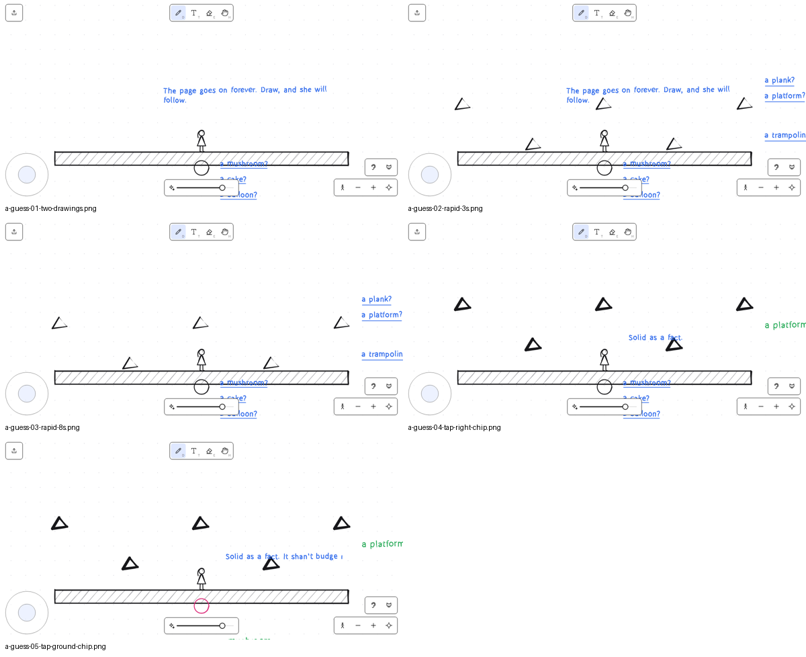
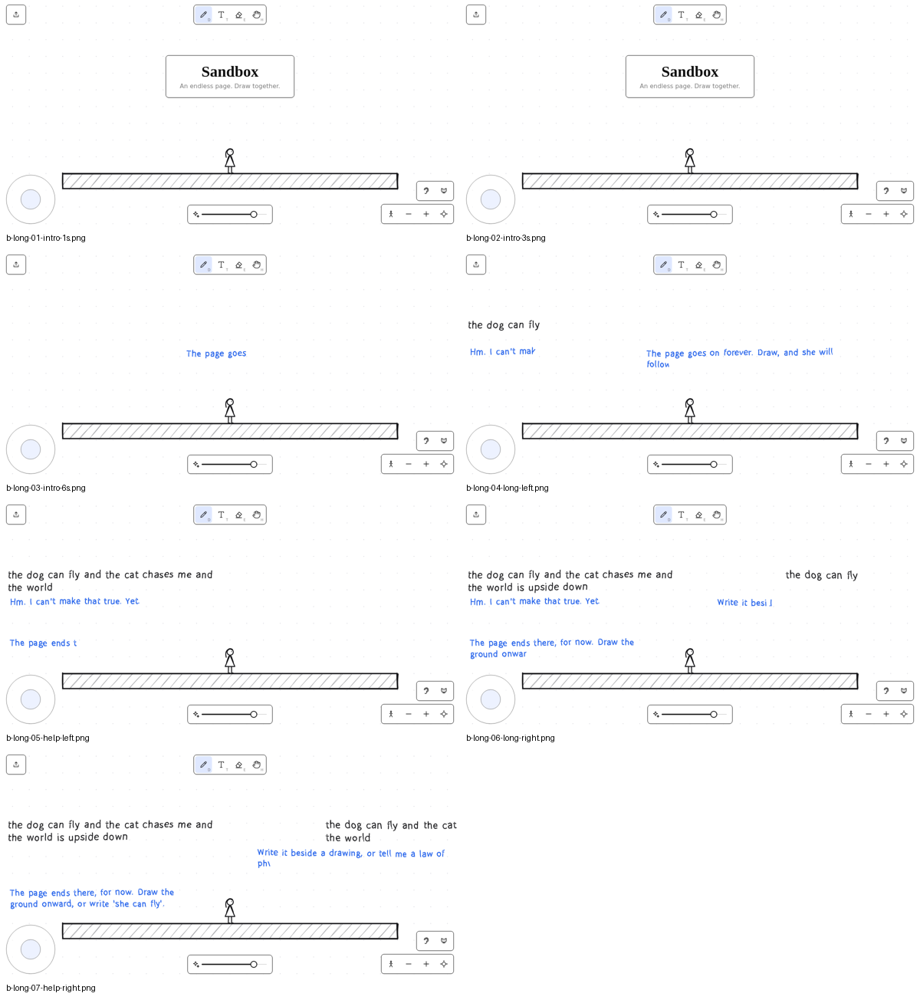
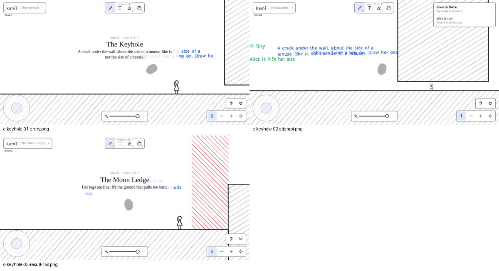
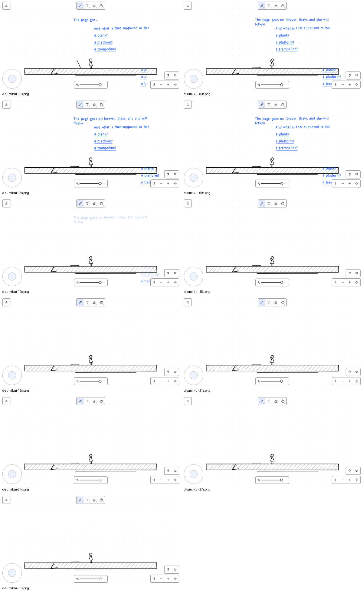

| Scenario | Expected | Observed | Status |
| --- | --- | --- | --- |
| Guess chips | Chips name drawings without overlapping notes or HUD | Six chips appeared; lower labels crowded the bottom HUD; inferred taps named drawings as `a platform` and `a mushroom` | Open: edge/HUD layout |
| Long notes | Long text wraps at words; replies stay visible | Left/right text wrapped at word boundaries; settled replies were complete; early intro frames only showed handwriting in progress | Pass; animation is not a clipping bug |
| Puzzle opening cards | Room line appears once after the card, not under it | Room intros were written behind the room card and duplicated the card line | Fixed: opening lines wait for the card and deduplicate |
| Keyhole / Moon Ledge | Obvious shrink/Moon solutions advance | `alice is tiny` reached room 3; `we are on the moon` reached room 4 | Pass |
| Dark Hall | Named lanterns light the hall and remain available | Sumikui consumed the named lantern drawing during the opening window, taking its light with it | Fixed: first 20 s hunts nameless drawings only |
| Twin Doors / Pit | Portal pair / bouncy + Moon solutions advance | Script drew portals outside the room and did not solve either room | Open measurement; not a confirmed bug |
| Shaft | `alice can fly` solves the shaft | Advanced to the Pit | Pass |
| Sumikui Sandbox | Summon, then measure eating/particles | Sandbox refused `summon the ink eater` by design; no Sumikui appeared | Pass by design; Puzzle accepts `summon the Sumikui` / `release the sumikui` |

The Dark Hall ate the **named lantern drawing**, not a separate light effect; removing that drawing removed its light.
