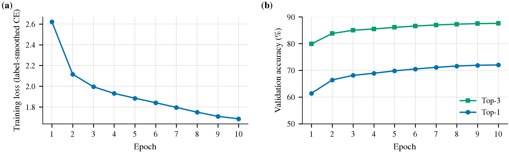
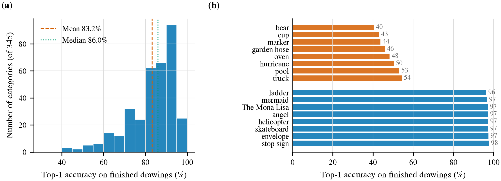
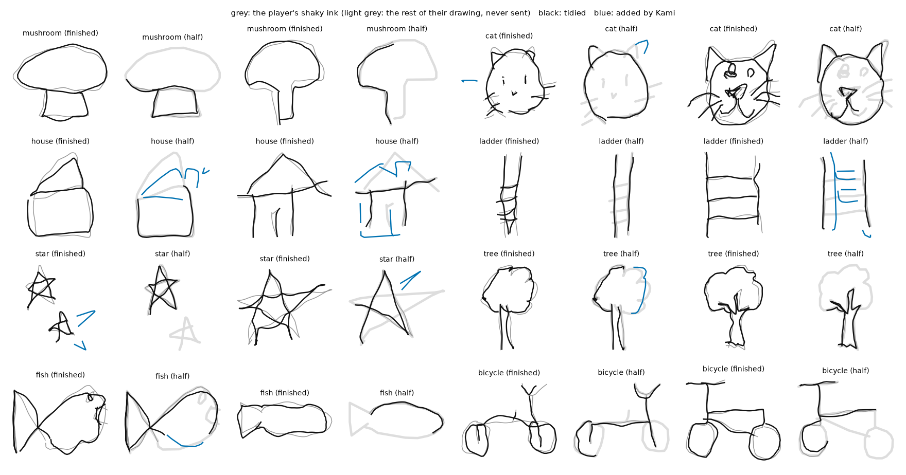

# Kami's Eye — training run and results (2026-09-20, the model that is live)

One ResNet-18 (64×64, one channel, 345 Quick, Draw! categories) trained **on the ASUS GX10** to name a
sketch whether it is finished or still being drawn. Figures are in `figures/` as PDF (vector, for slides
and print) and PNG (300 dpi); `figures/summary.json` holds every number below; `figures/src/` holds the
two scripts that made them (run on the box: one GPU pass over the held-out drawings, then the plots).
This is `kami-eye-xl`, the second run: the same recipe as the first (8,000 drawings per category, 8
epochs, 81.1 % / 94.2 % on finished drawings) on nearly three times the data.

| | |
|---|---|
| Data | 345 categories × up to 22,000 recognised drawings = 7.59 M; split 90 / 5 / 5 by drawing id, 379,277 of them test |
| Prefixes | half of all drawings are cut to a random 30–100 % of their points and re-fitted to their own bounds, so one model serves live guessing |
| Training | 10 epochs, batch 1024, AdamW + one-cycle, mixed precision, label smoothing 0.1; **about 2 h 50 min on the GB10 at 6,800 images/s** |
| Calibration | temperature 0.838 fitted on validation |
| Serving | ONNX on the box's CPU, about 12 ms per guess |

## Headline (test split, never seen in training or tuning)

| Drawings | n | Top-1 | Top-3 |
|---|---|---|---|
| Finished | 189,423 | **83.1 %** (95 % CI 83.0–83.3) | **95.2 %** |
| 90–100 % of points | 27,172 | 82.7 % | 95.1 % |
| 70–90 % | 54,004 | 76.2 % | 92.1 % |
| 50–70 % | 54,373 | 60.0 % | 81.6 % |
| 30–50 % | 54,305 | 36.7 % | 60.0 % |

For scale: the k-NN baseline it replaces reaches 65.1 % / 82.9 % on finished drawings over **42**
categories (`prefix-knn.md`); this model is 18 points better at top-1 over **eight times** the vocabulary.
The two are not measured on the same set, so the comparison in Figure 2 is indicative only.

### Like for like with the k-NN's 42 categories

The first run (8,000 drawings per category; this restriction has not been re-measured for the model
above, which is about two points better throughout) with its answer restricted to the 42 categories the
k-NN knows, on the test drawings of those categories (`figures/src/like_for_like.py`, run on the box). The k-NN column is from
`prefix-knn.md`; its held-out drawings are different ones from the same dataset, its index holds 300
drawings per category against the model's 8,000, and its "ink shown" points are single values where the
model's are ranges — so read the gap, not the decimals.

| Ink shown | Kami's Eye, top-1 / top-3 | n | Prefix k-NN, top-1 / top-3 |
|---|---|---|---|
| finished | **94.0 % / 99.3 %** | 8,430 | 65.1 % / 82.9 % |
| 50–70 % (k-NN: 60 %) | 84.0 % / 97.1 % | 2,466 | 47.3 % / 69.0 % |
| 30–50 % (k-NN: 40 %) | 67.9 % / 90.2 % | 2,402 | 32.7 % / 57.9 % |

## Figures

**Figure 1 — Training progress** (`fig1_training`). (a) Training loss per epoch; (b) validation top-1 and
top-3, where half the validation drawings are partial (72.0 % / 87.6 % at the end). Nearly three times
the data and two more epochs bought two points on finished drawings and three on half-drawn ones.

**Figure 2 — Accuracy against how much has been drawn** (`fig2_accuracy_vs_progress`). Test split, 10-point
bins of the share of points shown; open markers are finished drawings. Dashed grey: the prefix k-NN on its
own 42-class held-out set. By 65 % of the ink the right answer is in the top three 85 % of the time.

**Figure 3 — Can Kami name a drawing without asking?** (`fig3_calibration_selective`). (a) Reliability:
stated confidence against observed accuracy; finished drawings are well calibrated (ECE 1.0 %), partial
ones are over-confident (ECE 6.3 %). (b) Selective prediction: naming only the most confident drawings.
Open circles mark 95 % precision: **confidence ≥ 0.78 names 71 % of finished drawings and is right 95 % of
the time**; the remaining 29 % get the three-guess question. For drawings 50–100 % complete the same
precision needs ≥ 0.89 and covers 43 %; below half the ink it takes ≥ 0.99 and covers 1 %, which is to say
Kami waits. The server's floors are a little stricter (0.80 finished, 0.90 partial).

**Figure 4 — Which categories are hard** (`fig4_per_class`). (a) Per-category top-1 on finished drawings:
mean 83.2 %, median 86.0 %, 119 categories at 90 % or better, 5 below 50 %. (b) The eight hardest and
easiest. The hard ones are mostly pairs people draw alike.

**Figure 5 — Kami tidies a drawing without taking it over** (`fig5_morph_contact_sheet`). Real held-out
Quick, Draw! sketches, shaken to imitate an unsteady hand, finished and cut to their first half. Grey: the
ink sent; black: the same strokes after the morph at the slider's middle; blue: parts added. The exemplar
is the one whose ink is most like the sketch, in the pose the sketch faces (`ml/likeness.py`), and the
morph is as firm as Kami is sure (`ml/morph.py`, rules in `ml/CONTRACT.md`). Measured with
`ml/morph_review.py` on 120 held-out drawings as they are, wobbly, mirrored, turned and tilted: at the
slider's middle the result stays within 1.3 % of the drawing's diagonal of what was drawn (mean; 1.8 % at
the 90th percentile) and adds a part with a loose end to one drawing in fifteen; at the slider's end it is
the dataset's drawing, 2.1 % away. About 55 ms per drawing on the box's CPU.

## The commonest mistakes are near-synonyms

Most frequent confusions on finished test drawings: birthday cake ↔ cake, hexagon → octagon,
hurricane → tornado, bus ↔ school bus, cup / coffee cup → mug, truck → pickup truck,
telephone → cell phone, violin → guitar, radio → stereo. The game already folds several of these pairs
into one word before answering (`server/natures`), so what a player sees is somewhat better than the raw
83.1 %; that folded accuracy has not been measured.

## Caveats

One run, one seed. Held-out drawings come from the same Quick, Draw! distribution as training — real
Apple Pencil ink on an iPad has not been evaluated. Prefixes are cut by point count, not by time.
